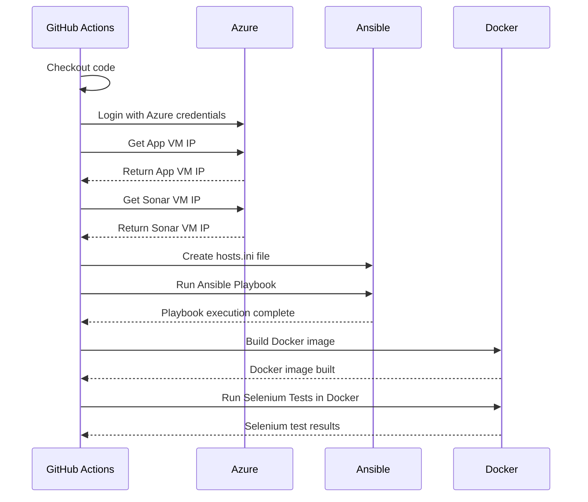

# Deployment Workflow Explanation

## Explanation of the Workflow

1. **Trigger on Push to Main Branch**:
   - The workflow is triggered when a developer pushes or pr code to the `main` branch.

2. **Checkout Code**:
   - The workflow starts by checking out the repository code using the `actions/checkout@v4` action.

3. **Azure Login**:
   - The workflow logs into Azure using the `azure/login@v1` action with credentials stored in the `AZURE_CREDENTIALS` secret.

4. **Retrieve VM IPs**:
   - The workflow retrieves the public IP addresses of the application VM (`App-vm`) and the Sonar VM (`Sonar-vm`) using Azure CLI commands. These IPs are stored for later use.

5. **Create Ansible Hosts File**:
   - The workflow navigates to the `ansible` directory and dynamically creates a `hosts.ini` file containing the IP address of the Sonar VM and credentials for Ansible.

6. **Run Ansible Playbook**:
   - The workflow runs an Ansible playbook (`playbook.yml`) using the generated `hosts.ini` file to configure the VMs.

7. **Build Docker Image**:
   - The workflow builds a Docker image for Selenium tests using the `docker build` command in the `selenium-test` directory.

8. **Run Selenium Tests**:
   - The workflow runs Selenium tests inside a Docker container, passing the application VM's IP address as an environment variable.

---

## Alternate Cases in the Workflow

- **Azure Login Fails**:
  - If the Azure login fails, the workflow stops, and an error is reported.

- **VM IP Retrieval Fails**:
  - If the IP addresses of the VMs cannot be retrieved, the workflow stops, and an error is reported.

- **Ansible Playbook Fails**:
  - If the Ansible playbook fails to execute, the workflow stops, and an error is reported.

- **Docker Build Fails**:
  - If the Docker image build fails, the workflow stops, and an error is reported.

- **Selenium Tests Fail**:
  - If the Selenium tests fail, the workflow stops, and an error is reported.

---

## How This Workflow Works

1. **Trigger**:
   - The workflow is triggered on a push to the `main` branch.

2. **Checkout Code**:
   - The repository code is checked out using `actions/checkout@v4`.

3. **Azure Login**:
   - The workflow logs into Azure using credentials stored in the `AZURE_CREDENTIALS` secret.

4. **Retrieve VM IPs**:
   - The workflow retrieves the public IP addresses of the application and Sonar VMs using Azure CLI commands.

5. **Create Ansible Hosts File**:
   - The workflow creates a `hosts.ini` file in the `ansible` directory with the Sonar VM's IP and credentials.

6. **Run Ansible Playbook**:
   - The workflow runs an Ansible playbook to configure the VMs.

7. **Build Docker Image**:
   - The workflow builds a Docker image for Selenium tests.

8. **Run Selenium Tests**:
   - The workflow runs Selenium tests in a Docker container, passing the application VM's IP as an environment variable.